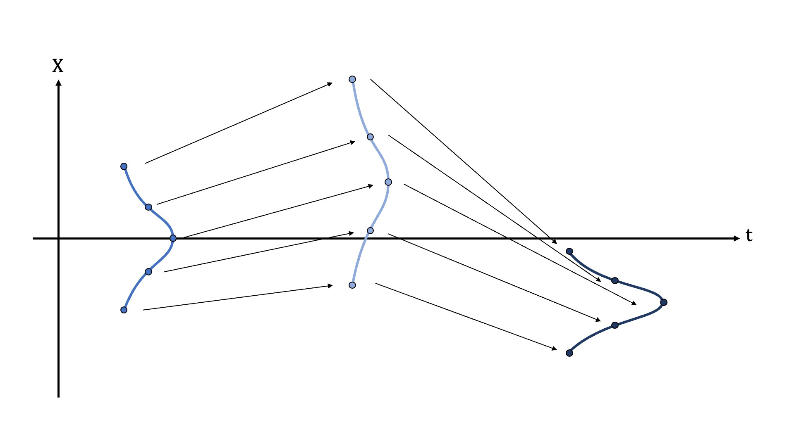
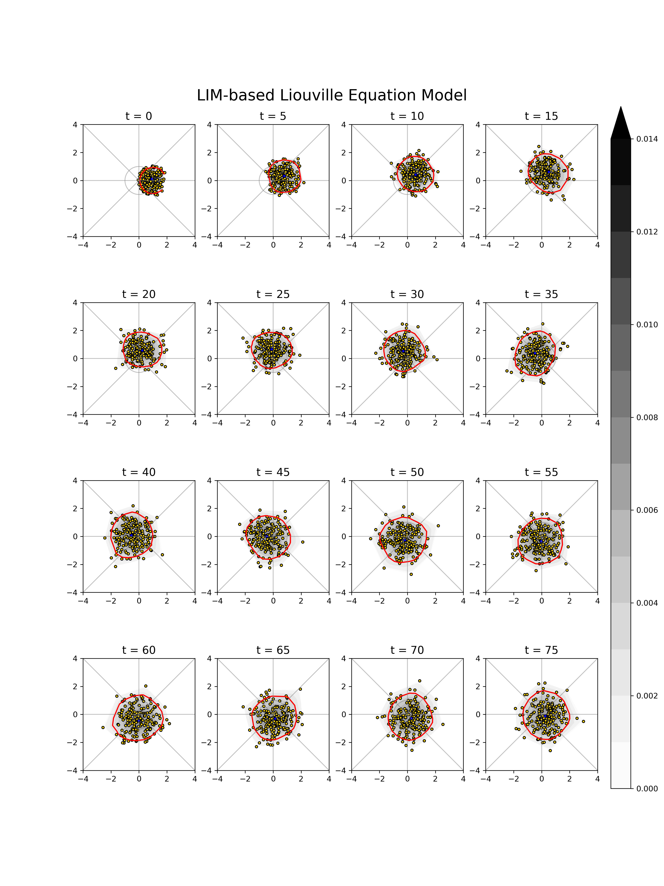

# MJO-probabilistic-forecast

This repository briefly demonstrate the framework of MJO probabilistic forecast framework based on Liouville's theorem (Liouville 1838). 

## Liouville equation

Liouville's theorem states that a distribution function is constant while moving along any trajectories in phase space.

Liouville equation is given by
$$
\frac{d \rho}{dt} = \frac{\partial \rho}{\partial t} + \vec{v} \cdot \nabla \rho = -\rho \nabla \cdot \vec{v}
$$
where $\rho$ is ensemble density, $\vec{v}$ is the information flow in the phase space. Liouville equation can be used to describe the evolution of a probability density function (PDF) in a phase space. It is worthnoting that Liouville equation is mathematically identical to the continuity equation in fluid dynamics. Both of them have similar physical insights, the continuity equation infers the conservation of mass, and Liouville equation infers the conservation of information.

We apply Liouville equation on probabilistic forecast of MJO. The concept can be briefly introduced by the following schematic:

In the beginning, we create a PDF as the initial condition. The PDF is resolved by several (~200) particles in the phase space. The particles carries ensemble density while they are moving in the phase space. By predicting the movement of the particles, and calculating the Lagragian change of ensemble density, we are able to predict the whole PDF with the aid of Liouville equation.

The framework of MJO probablistic forecast can be summarized as follows:
1. Predicting the movement of particles using a linear inverse model (LIM), details are provided in [calc_noise.ipynb](calc_noise.ipynb).
2. Calculating the Lagragian change of ensemble density using Liouville equation, details are provided in [calc_determinant.ipynb](calc_determinant.ipynb).

The complete code of forecast is in [forecast.py](forecast.py). This python file outputs the [movement of particles](particles_forecast.npy) and the [evolution of ensemble density](rho_forecast.npy). The result of forecast is shown in following figure:

where the predicted PDF is shaded, the red contour is the 95% confidence interval, the gold points are the particles used to resolve the PDF.

## References
Joseph Liouville. Note sur la théorie de la variation des constantes arbitraires. Journal de mathématiques pures et appliquées, 3:342–349, 1838.

## Acknowledgement
Thanks to my advisor, also the original algorithm developer, Dr. Kai-Chi Tseng: https://github.com/kuiper2000